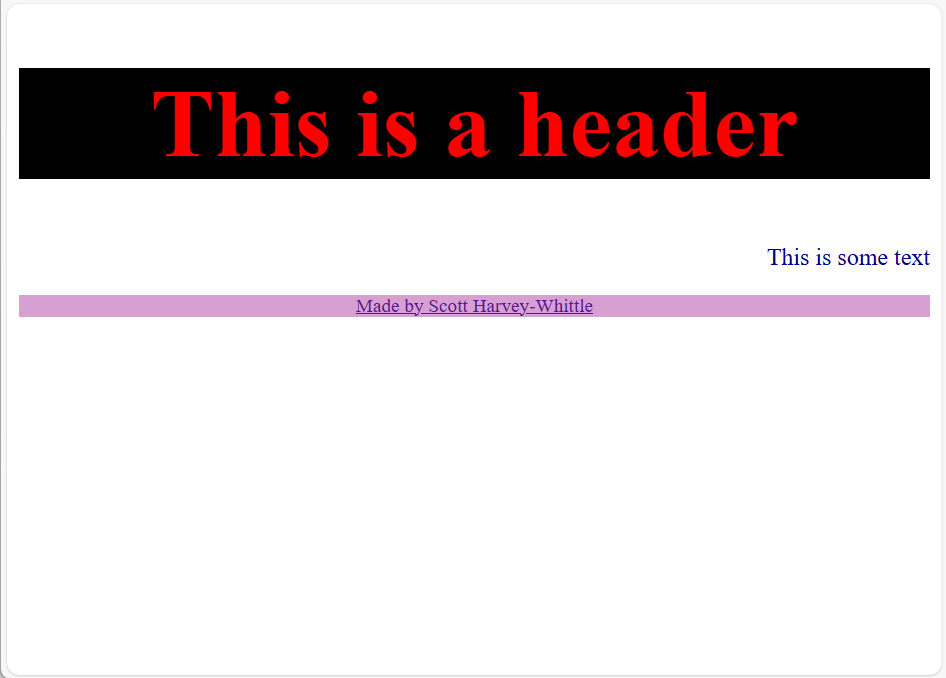

# Code Institute 5-Day Coding Challenge
In this reposotory, I learnt about the structure of a webpage, how to style it and how to add logic to the website. 

## HTML
I learnt about tags such as:<br> 

+ `<h1></h1>` through to `<h5></h5>` for heading
+ `<p></p>` for writing text
+ `` for inserting images
+ Symantic tags such as `<header></header>`, `<body></body>` and `<footer></footer>`.
+ The `<link>`tag to referance wither other documents within my code base or to external documents

## CSS
I learnt about the following:<br>

+ <strong>Selecting a tag</strong>
In the HTML file: `<p>`<br>
Then in the CSS you would write the following:<br>
<pre>p {
    font-size: 1em;
    color: darkblue;
    text-align: right;
}</pre>
+ <strong>id Selector</strong><br>
In the HTML file: `<div id="header">`<br>
Then in the CSS you would write the following:<br>
<pre>#header {
    font-size: 2em;
    text-align: center;
    color: #FF0000;
    background: #000000
    
}
</pre>
&nbsp; &nbsp; id selectors can be used over and over making your code efficient.
+ <strong>Class Selector</strong><br>
In the HTML file:
`<footer class="footer">`
Then in the CSS you would write the following:<br>
```
.footer {
    text-align: center;
    color: #06e620;
    font-size: 80%;
    background-color: #d6a0d3;
}
```

<pre>       Class selectors can only be used once. in the above example, the 
       class selector `"class"` can only be used once.</pre>
So it will look as follows:

<br>
Example of this repo can be found by going to: <a href="example">The Example Folder</a>


